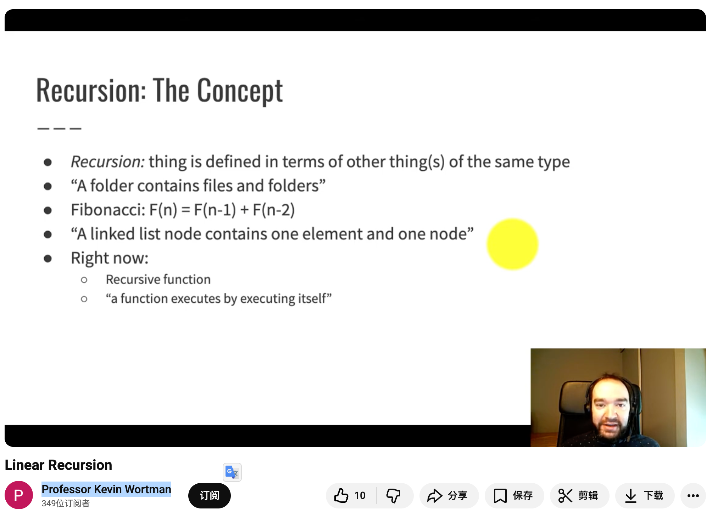
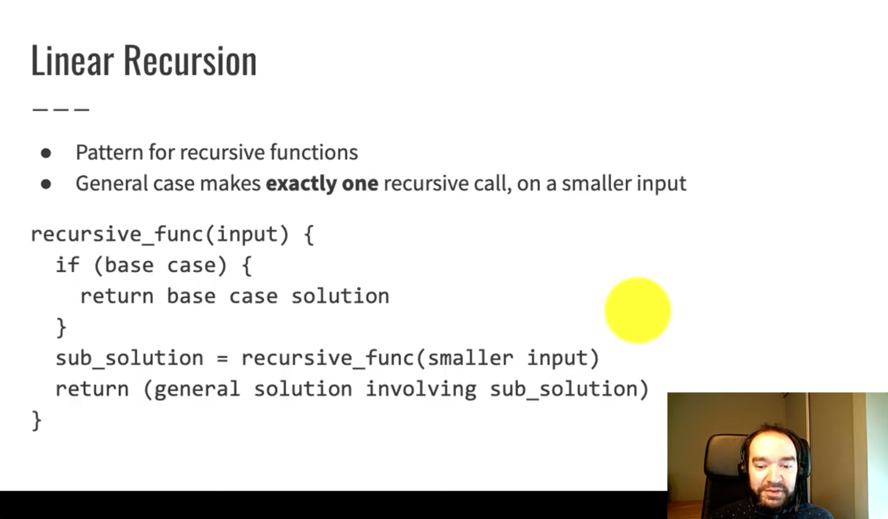
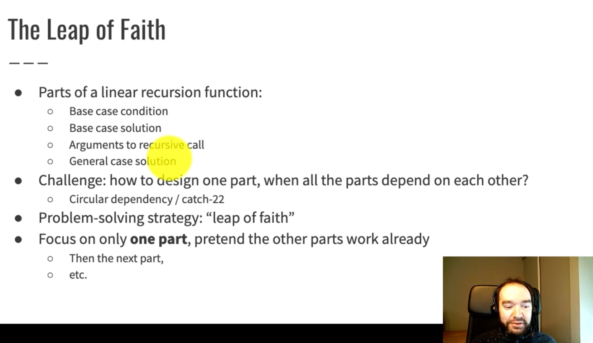

# 203. 移除链表元素
[力扣题目链接](https://leetcode.cn/problems/remove-linked-list-elements/description/)
## 删除节点两种情况：  
1. 删除头节点：head = head.next  
2. 删除非头节点：node.next = node.next.next
3. 增加 dummy head 统一两种情况  
### 代码实现
```python
#dummy head solution

# Definition for singly-linked list.
# class ListNode:
#     def __init__(self, val=0, next=None):
#         self.val = val
#         self.next = next
class Solution:
    def removeElements(self, head: Optional[ListNode], val: int) -> Optional[ListNode]:
        dummy = ListNode(0)
        dummy.next = head
        node = dummy
        while node.next != None:
            if node.next.val == val:
                node.next = node.next.next
            else:
                node = node.next 
        return dummy.next 
```
```python
#head 和 非head 分开处理

# Definition for singly-linked list.
# class ListNode:
#     def __init__(self, val=0, next=None):
#         self.val = val
#         self.next = next
class Solution:
    def removeElements(self, head: Optional[ListNode], val: int) -> Optional[ListNode]:
        while head != None and head.val == val:
            head = head.next
        if head == None:
            return head
        node = head 
        while node.next != None:
            if node.next.val == val:
                node.next = node.next.next
            else:
                node = node.next
        return head
```
```python
#head 和 非head 分开讨论 整体处理
#问题：走到valnode时怎么知道prev来删？答：多记录一个prev变量

# Definition for singly-linked list.
# class ListNode:
#     def __init__(self, val=0, next=None):
#         self.val = val
#         self.next = next
class Solution:
    def removeElements(self, head: Optional[ListNode], val: int) -> Optional[ListNode]:
        node = head
        prev = head
        while node != None:
            if node.val == val:
                if node == head:
                    head = head.next
                    node = head
                    prev = head
                else:
                    node = node.next
                    prev.next = prev.next.next
            else:
                prev = node
                node = node.next
        return head
```
## 链表的递归属性  
[油管Professor Kevin Wortman的linear recursion教程](https://www.youtube.com/watch?v=_sqAF7llUec&list=PLd9A0clOZAdU_7z5kSlKldniK6yuREHPD&index=28)  
[油管Professor Kevin Wortman的singlelinkedlist-recursion教程](https://www.youtube.com/watch?v=AVjPPv2kCrQ&list=PLd9A0clOZAdU_7z5kSlKldniK6yuREHPD&index=27)  



```python
#递归

# Definition for singly-linked list.
# class ListNode:
#     def __init__(self, val=0, next=None):
#         self.val = val
#         self.next = next
class Solution:
    def removeElements(self, head: Optional[ListNode], val: int) -> Optional[ListNode]:
        if head == None:
            return None
        
        #递归的信仰：子问题已经被完美解决了
        head.next = self.removeElements(head.next, val)

        if head.val == val:
            return head.next
        else:
            return head
```
