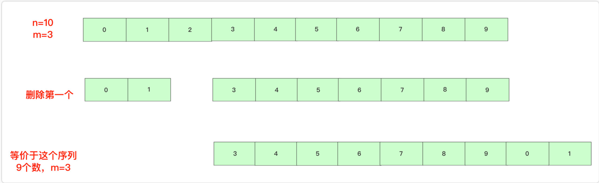
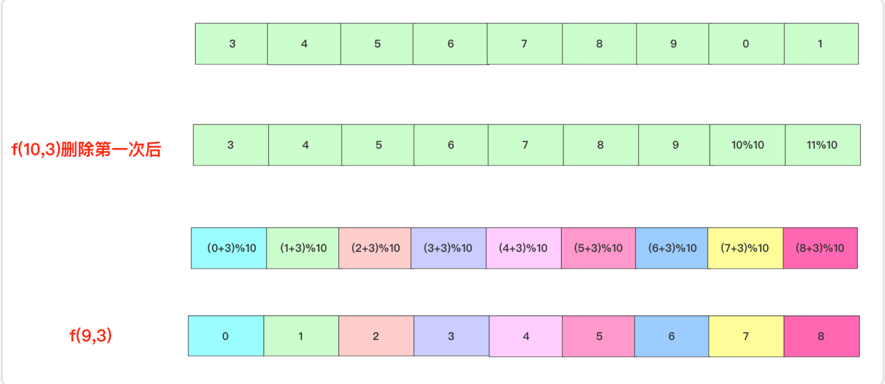
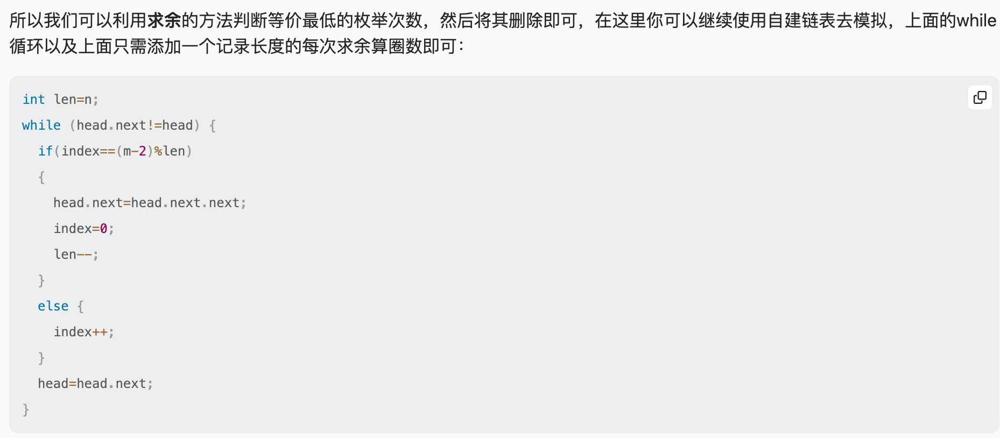

# Josephus Problem

[力扣题目链接1823](https://leetcode.cn/problems/find-the-winner-of-the-circular-game/description/)  
[力扣题目链接LCR 187](https://leetcode.cn/problems/yuan-quan-zhong-zui-hou-sheng-xia-de-shu-zi-lcof/description/)  
[bigsai大佬完美教程](https://leetcode.cn/discuss/post/764813/yue-se-fu-huan-wen-ti-de-san-chong-jie-f-w9q1/)

## 循环链表解法
```python
class Listnode:
    def __init__(self, val, next=None):
        self.val = val
        self.next = next
        
class Solution:
    def findTheWinner(self, n: int, k: int) -> int:
        head = Listnode(1)
        node = head
        for i in range(2, n+1):
            node.next = Listnode(i)
            node = node.next
        node.next = head

        if k == 1:
            return n
        i = 1
        node = head
        while node.next != node:
            if i == k-1:
                node.next = node.next.next
                i = 0
            i += 1
            node = node.next
        return node.val
```
### 说明
time complexity: O(n×m)  
1823题   提示:  
1 <= k <= n <= 500, accepted  
LCR187题 提示:  
1 <= num <= 10^5  
1 <= target <= 10^6  
TLE Time Limit Exceeded

## 数学解法
### 不关注流程模拟，直接状态推导
f(n,m)=(f(n-1,m)+m)%n  
f(n,m)指n个人，报第m个编号出列最终编号

#### 推导
有0 1 2 3 4 5 6 7 8 9十个数字，假设m为3,最后结果可以先记成f(10,3)  




f(10,3)=(f(9,3)+3)%10  
f(9,3)=(f(8,3)+3)%9  
……  
f(2,3)=(f(1,3)+3)%2  
f(1,3)=0  

#### 递归
```python
class Solution:
    def iceBreakingGame(self, num: int, target: int) -> int:
        if num == 1:
            return 0
        return (self.iceBreakingGame(num-1, target) + target)%num
```
#### 迭代
```python
class Solution:
    def iceBreakingGame(self, num: int, target: int) -> int:
        result = 0
        for i in range(1, num+1):
            result = (result + target)%i
        return result
```
### 说明
递归效率因为有个来回的规程，效率相比直接迭代差一些，也可从前往后迭代  

递归解法和迭代解法在算法逻辑上时间复杂度都是 O(n)，差异主要来自执行方式：递归引入了函数调用和调用栈管理的额外开销，而迭代在同一作用域内直接更新状态，因此常数因子更小、空间复杂度更优。

1823题编号不是0而是1开始，模运算结果是0开始致使递推关系也是按照编号0开始的情况，最终态幸存者在新的编号体系号码加一，按照0起步编号写recursion/迭代，然后最终结果加1  
#### 递归
```python
class Solution:
    def findWinner0index(self, n, k):
        if n == 1:
            return 0
        return (self.findWinner0index(n-1, k)+k)%n
    def findTheWinner(self, n: int, k: int) -> int:
        return self.findWinner0index(n, k)+1
```
#### 迭代
```python
class Solution:
    def findTheWinner(self, n: int, k: int) -> int:
        result = 0
        for i in range(2, n+1):
            result = (result+k)%i
        return result+1
```
### 待解决：  
我想依据bigsai的思路通过取模计算简化m极大时循环链表的解法使其不超时，  

然而我引入len变量之后反而m不够大也会超时，很可能是逻辑错误但我看不出来  

在修改之前引入len变量之前至少能跑过小数值情况，m,n很大时按预计因为O(n*m)的时间复杂度超时可以理解  
